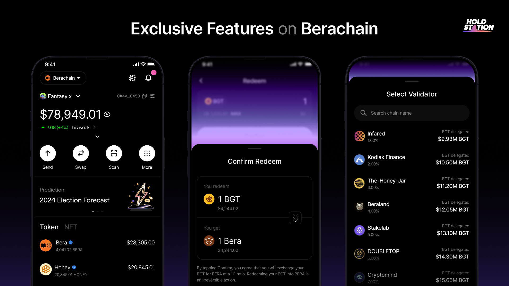

# 💳 DeFAI Smart Wallet

At Holdstation, we build beyond functionality, fostering a **Product Fit Community (PFC)** with our Smart Wallet on Berachain. Seamlessly integrated into Berachain’s vibrant ecosystem, it empowers users to engage and thrive together.

## Exclusive Features on Berachain

Holdstation Wallet unlocks unique tools, transforming it into the ultimate Berachain Hub:

* **Aggregator Swap**: Access top swap rates by aggregating liquidity pool price feeds across Berachain.
* **Manage Liquidity**: Deposit, withdraw, and manage your LP positions directly in the wallet.
* **Mint/Burn $HONEY**: Easily mint or burn $HONEY with a hassle-free wallet interface.
* **Delegate BGT**: Select validators and delegate BGT seamlessly within the wallet.
* **Redeem BGT**: Convert BGT to BERA effortlessly with in-wallet redemption.

## Seamless Integration and Interaction

* **One-Click DeFi Access**: Navigate Berachain’s DeFi landscape with a user-friendly interface, deploying assets into protocols for earning opportunities—perfect for beginners and pros.
* **Smart Asset Management**: Track real-time asset performance, whether stored or staked, ensuring you maximize yields and monitor movements.

## Enhancing the Berachain Flywheel

* **Earning Opportunities**: Discover optimal staking options with market-driven suggestions based on protocol performance.
* **Governance Participation**: Vote on Berachain proposals directly from the wallet, shaping the ecosystem’s future.
* **Community Connection**: Engage with social features to connect, share insights, and join community initiatives, reflecting Berachain’s innovative spirit.

## Security and Simplicity

* **Safe by Design**: Leverage Berachain’s native security for fast, cost-effective, and secure transactions.
* **User-Centric Interface**: Enjoy a scalable, simple design for complex DeFi strategies or daily tasks.
