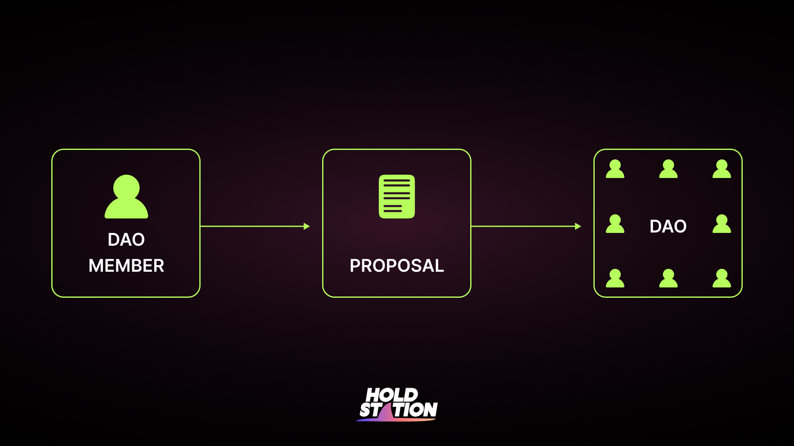

As a community-driven platform, we value the contribution of our early adopters and supporters. Therefore, we are excited to announce our airdrop program for early contributors, including affiliates and users, who play a crucial role in building and promoting our platform.

At Holdstation Foundation, we are committed to fostering a decentralized and democratic ecosystem. Our governance model is inspired by the best practices of DAOs, ensuring that all stakeholders have a say in the development and direction of our platform. Stay tuned for more updates and exciting developments from Holdstation Foundation.

| Role                   | Responsibilities                                                    | Benefits                                                                                                                                        |
| ---------------------- | ------------------------------------------------------------------- | ----------------------------------------------------------------------------------------------------------------------------------------------- |
| Proposal Submitter     | Any token holder can submit a proposal for consideration by the DAO | -                                                                                                                                               |
| Affiliate Agencies     | Bring new users to the platform                                     | Eligible to **earn direct USDC rebate and up to  5% of future tokens allocation**, and control and voting rights for the future of the protocol |
| DAO Delegates          | Participate in governance decisions                                 | Influence the direction of the protocol and earn a portion of future token allocations.                                                         |
| Holdstation Foundation | Manage the development of the protocol and oversee governance       | Ensure the protocol operates efficiently and effectively for the benefit of all stakeholders                                                    |

## How to propose to the DAO?

1. **Submit your proposal:** Visit the Holdstation Community Forum and submit your proposal. Make sure to provide a clear and concise description of your project, including goals, timeline, and budget.
2. **Community Review:** Your proposal will be reviewed by the Holdstation community, who will evaluate its feasibility, impact, and alignment with the foundation's goals and values.
3. **Voting:** If your proposal passes the community review, it will be put up for a vote by the Holdstation Foundation DAO members. The proposal will need to receive a certain amount of votes to be approved.

