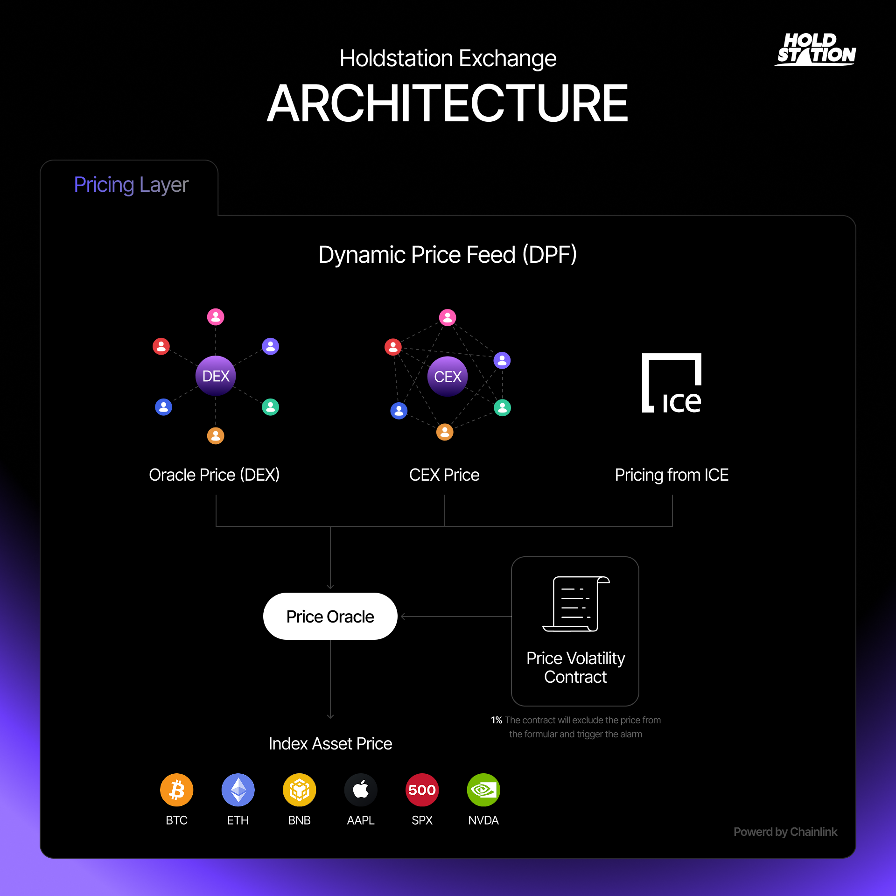

Holdstation's Dynamic Price Feed (DPF) is an essential tool that provides accurate prices for all assets traded on the platform. It uses smart data collection methods to deliver fair and trustworthy values, making trading smooth and reliable.

## Key Features 

* **Flexible Market Making (FMM)**: DPF works hand-in-hand with Holdstation's FMM system, allowing efficient trading across a wide variety of assets.
* **Chainlink Data Streams and CEX Averages**: Holdstation uses Chainlink for high-quality oracle data and average prices from top centralized exchanges (CEXs). This setup provides the best, fair prices while avoiding fake spikes or manipulations.
* **US Stock Pricing from ICE**: For US stocks,[ prices come directly from the Intercontinental Exchange (ICE)—the owner of the New York Stock Exchange (NYSE)](https://www.coindesk.com/business/2025/08/11/chainlink-teams-up-with-nyse-parent-ice-to-bring-forex-precious-metals-data-on-chain). This gives users top-tier, professional-level data they can trust.

This layered system makes Holdstation a reliable choice for secure, manipulation-free trading.

