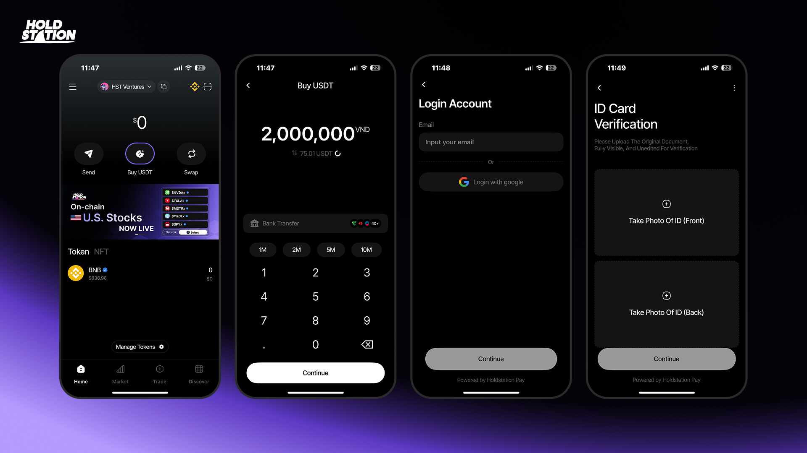
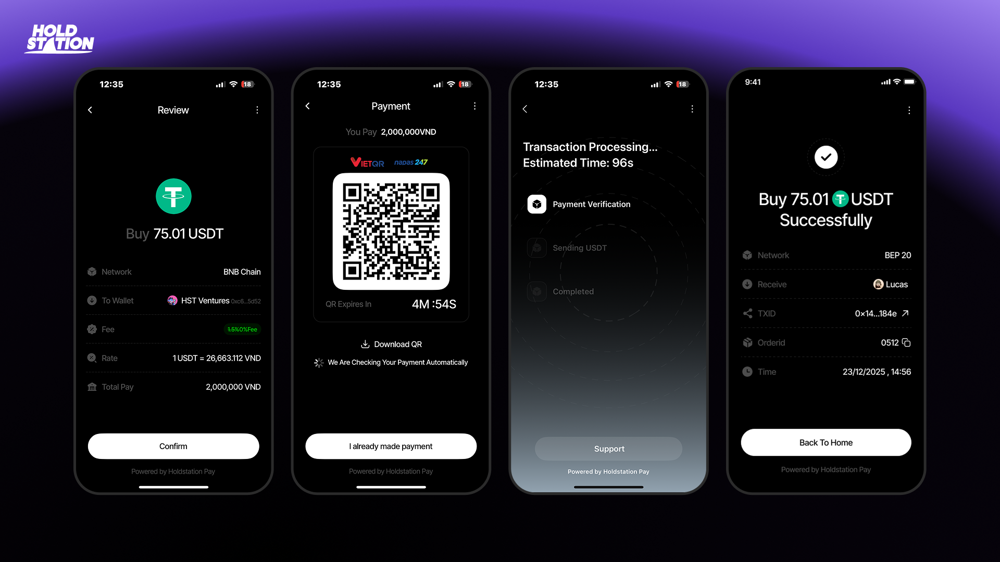

Holdstation Pay lets you buy **USDT/USDC/USD1 directly with VND in under 30 seconds**, supporting both **BNB Chain** and **Solana**. The process is fully **KYC-compliant** and optimized for user experience. Beyond USDT, users can also **buy tokens, join Launchpad events, and purchase U.S. stocks on-chain using VND**.

### **Prerequisites**

* A registered **Holdstation account**.
* Completed **KYC verification** (required for first-time use).
* Linked **VND payment method** (bank transfer or e-wallet).

## **Step-by-Step Usage**

#### 1. Open Holdstation Pay

* Launch the **Holdstation app** and go to the home screen.

#### 2. Select **Buy USDT**

* Tap “Buy USDT.”
* Choose your blockchain: **BNB Chain** or **Solana**.

#### 3. Enter VND Amount

* Input the amount of VND you want to spend.
* The system automatically converts it to **USDT** at the **real-time exchange rate**.

#### 4. Register / Log In

* If new, enter your email to **create an account**.
* If existing, this step is skipped automatically.

#### 5. Complete KYC (if not done)

* Verify your **Vietnamese ID Card (CCCD)** via VNID.
* Upload front and back images of your ID.
* If already verified, the system auto-skips.

#### 6. Review and Confirm Order

* Check full order details: **VND amount, USDT received, fees, and wallet address**.
* Tap **Confirm** to proceed.

#### 7. Pay via QR Code

* The system generates a **QR Code** for payment.
* Scan the QR and transfer the exact amount with correct details.
* The QR has a time limit — complete payment within the displayed countdown.

#### 8. Transaction Processing

* Once payment is made, the system auto-verifies.
* Status updates in real time: **Payment Verification → Sending USDT → Completed**.

#### 9. Transaction Completed

* Success screen shows: **Network, TXID, Order ID, and Timestamp**.
* Tap **Back to Home** to finish.
* USDT is automatically credited to your **Holdstation wallet**.

## **Additional Features**

* **Buy other tokens**
* **Join Launchpad events**
* **Purchase U.S. Stocks on-chain with VND**\
  → Follow the same process as buying USDT.

## **Tips**

* Enable **2FA** for maximum security.
* Always check **exchange rates and limits** in-app before trading.
* Contact **Support** in-app for any issues.

