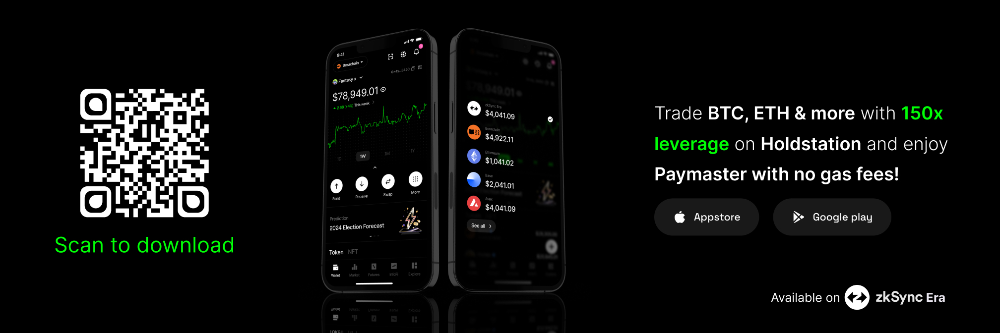

Holdstation is a **modular financial operating system (OS)** designed with a deep commitment to the **Product Fit Community**, crafting solutions for real users with real needs. From its inception, every feature is tailored through cultural and behavioral alignment with its user base, refined via real-time feedback, and powered by cutting-edge technology focused on long-term value creation. 

## What Sets Holdstation Apart?

* **Product Fit Community**: Unlike generic platforms chasing trends, Holdstation builds with its users in mind, aligning products to specific ecosystems—BNBChain, Solana, and World Chain—ensuring relevance and engagement through continuous community input.
* **AI Agent Integration**: Holdstation embeds intelligent AI agents across its ecosystem, from market analysis to personalized trading strategies, empowering users with data-driven insights to navigate DeFi complexities effortlessly.
* **AI Matching Pool (AIMP)**: As a cutting-edge technology, AIMP leverages AI to enable zero-slippage trading on Holdstation’s DeFutures platform, seamlessly matching long and short orders to enhance trading efficiency.
* **One-Click Simplicity**: Holdstation abstracts blockchain friction—eliminating seed phrases and gas fees—delivering a seamless, guided financial experience for all.

### Holdstation on World Chain

Holdstation thrives on World Chain, connecting with authenticated users verified via Orb and World ID, ensuring a genuine human network free from bots or sybil attacks. This creates an ideal space for high engagement and sustainable tokenomics.

* **World Chain Performance (as of August 14, 2025)**:
  * **678,000+ users**
  * **40M+ user actions**
  * **350,000+ monthly active users**
* **Top Mini-Apps**:
  * **Eggs Vault**: Over 15 million eggs opened, driving daily engagement.
  * **AION**: An AI-based market forecast app, guiding hundreds of thousands in their trades.\
    Holdstation’s focus on World Chain accelerates mass adoption, bridging Web2 and Web3 users into a unified financial ecosystem.

### Holdstation Perpdex on BNBChain

Holdstation’s perpdex on BNBChain leverages the chain’s renowned speed and cost-efficiency, offering lightning-fast transactions and ultra-low fees. As the **first USD1 perpdex**, it boasts:

* **High Liquidity**: Robust pools of USD1 and USDT ensure smooth trading.
* **Large User Base**: Supported by a thriving community of over **360,000 monthly active users** (based on recent data).
* **Full Community Support**: Backed by active governance and user-driven enhancements.
* **Superior Performance**: Ideal for traders seeking rapid execution and minimal costs, enhanced by the **AIMP** for zero-slippage trades with up to **100x leverage**.

### Holdstation Go Multichain: Pioneering RWA and AI Hub

Holdstation’s expansion to Solana positions it as the default financial interface for AI-native DeFi, capitalizing on the chain’s speed, low costs, and vibrant community. A key focus is **Real World Assets (RWA)**, partnering with Ondo to tokenize and trade assets like US stocks and bonds.

* **RWA Integration**: Collaborate with Ondo to bring tokenized US stocks and real estate, offering users exposure to traditional markets with DeFi efficiency.
* **AI-Native User Base**: Serve Solana’s growing hub for onchain AI experimentation, bridging users to intelligent agent infrastructure.
* **Launchpad for AI Agents**: Enable users to deploy, interact, and co-own AI agents, transforming wallets into smart investment tools with Solana’s parallel processing.
* **Community-Led Growth**: Align with Solana’s retail traders, degens, and builders, fostering innovation through a user-centric approach.
* **Gasless UX + Mobile-First**: Deliver a seamless, multichain experience with real-time bridging and cross-chain AI communication, optimized for mobile users.

> **Info**
>
> All designed for real users, real needs, and real growth.
