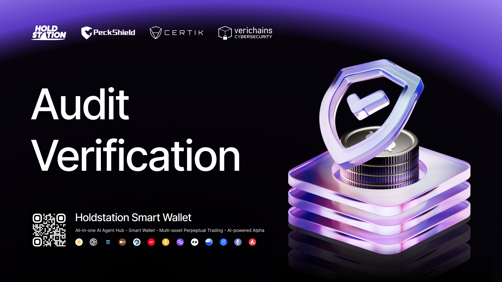

# 🔐 Audit

Holdstation is proud to have undergone a thorough audit by VeriChain, a leading blockchain auditing firm. Our existing working product has been functioning smoothly and securely for almost a year now, with no reported hacks or security breaches. 

* [**PeckShield Audit**](https://github.com/peckshield/publications/blob/master/audit_reports/PeckShield-Audit-Report-Holdstation-v1.0.pdf?ref=blog.holdstation.com)
* [**Certik Audit**](https://skynet.certik.com/projects/holdstation)
* [**Holdstation Wallet Audit**](https://github.com/verichains/public-audit-reports/blob/main/Verichains%20Public%20Audit%20Report%20-%20Holdstation%20Mobile%20Wallet%20-%20v1.0.pdf)
* [**Holdstation DeFuture Audit**](https://github.com/verichains/public-audit-reports/blob/main/Verichains%20Public%20Audit%20Report%20-%20HoldStation%20Defutures%20-%20v1.4.pdf)
* [**Holdstation Launchpad Audit**](https://github.com/verichains/public-audit-reports/blob/main/Verichains%20Public%20Audit%20Report%20-%20Holdstation%20Launchpad%20-%20v1.1.pdf)
* [**Holdstation Swap**](https://github.com/verichains/public-audit-reports/blob/main/Verichains%20Public%20Audit%20Report%20-%20Holdstation%20Dex%20-%20v1.0.pdf)

We understand that security is of the utmost importance when it comes to investing in cryptocurrency, and that's why we are committed to maintaining the highest level of security for our users. 

At Holdstation, we believe in building trust and confidence with our users, and that's why we take security and auditing seriously. In the future, we plan to undergo audits with other **leading firms such as Certik, to further ensure that our users' funds are always SAFU** (Secure Asset Fund for Users). 
