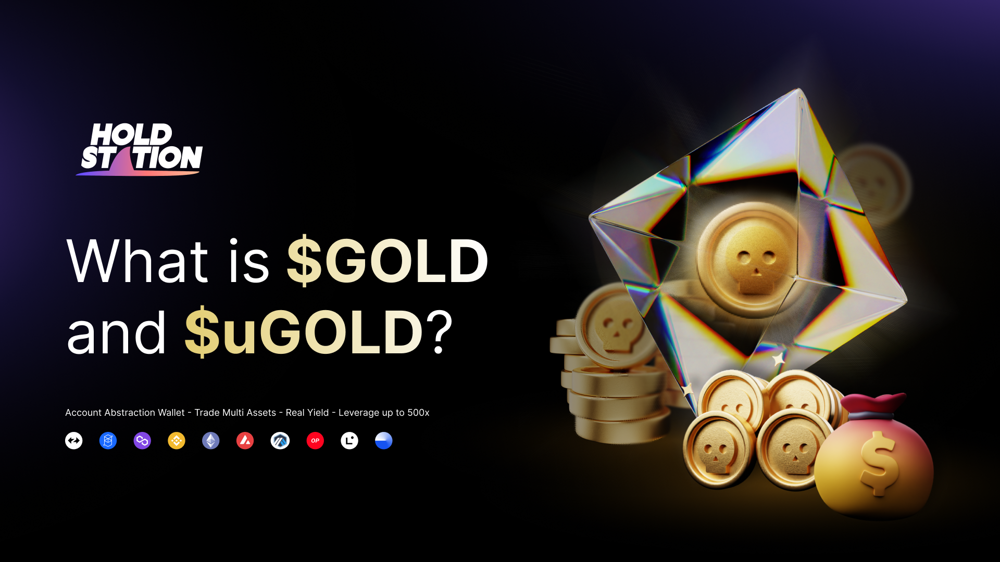
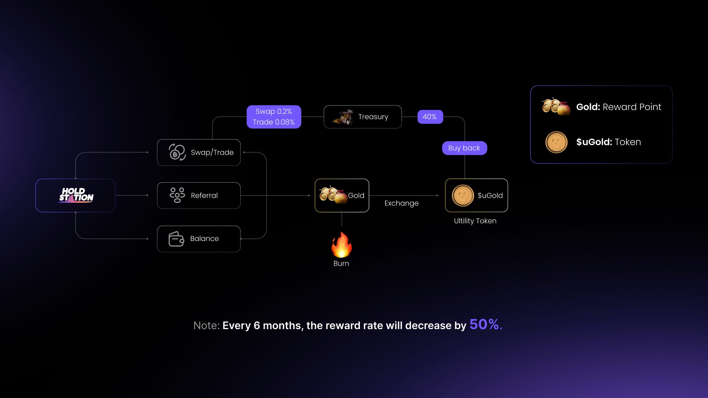
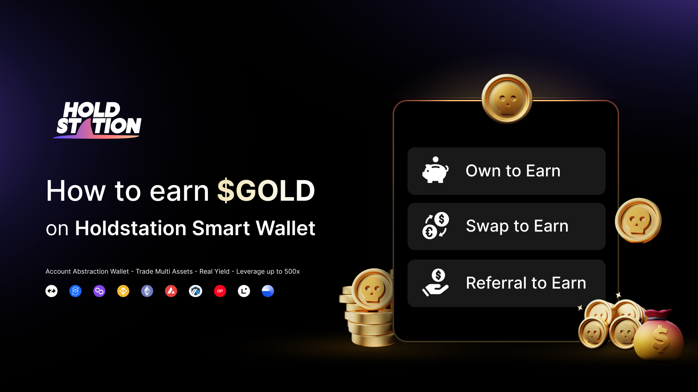
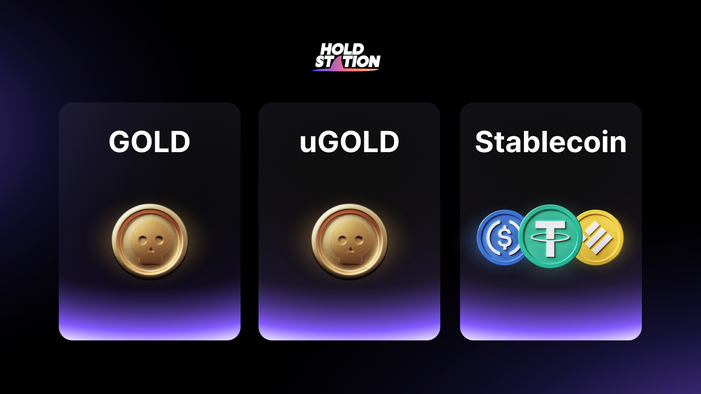

# 🥇 GOLD

Introducing **Holdstation's Gold Reward Point** - the all-in-one solution to earn rewards while trading and referring your friends. With our innovative reward point system, you can accumulate points by simply swapping and trading on Holdstation Wallet. The more you trade, the more points you earn!

But that's not all. You can also invite your friends to the platform and earn even more points. And if that wasn't enough, you'll also receive daily interest on your wallet balance, making your points work for you even when you're not actively trading.

## Why earn GOLD?

Holdstation's GOLD reward point is an essential part of our ecosystem that offers various benefits to our users.

* GOLD can be to uGOLD (unlock GOLD) then exchanged for stablecoin or another ERC-20 tokens
* GOLD can be used to access in-app benefits.
* GOLD supply will **deflate by half every six months.**
* Holding more GOLD will increase the chances of receiving future rewards.

## How can you earn?

| Action             | Details                                                                                                  | GOLD Earn                                                           |
| ------------------ | -------------------------------------------------------------------------------------------------------- | ------------------------------------------------------------------- |
| **Trade & Swap**   | Trade & Swap on Holdstation wallet to reward some point                                                  | Equivalent to the volume you swap & trade                           |
| **Wallet Balance** | 
The higher your balance, the bigger the rewards <em>(subject to top 100 market cap token)</em>
 | Calculating and adding your GOLD bonus to your balance every minute |
| **Referral**       | Invite friends to use Holdstation. Every user you refer, you will earn equivalent GOLD                   | Base on the numbers of users you refer                              |

_**FYI: The next deflationary of GOLD will be on 29/12/2024**_

### **How to refer?**

1. Sign your wallet
2. Share your custom referral link with your friends and followers.
3. When you **swap tokens or make a trade,** a pop-up link will appear that you can share with your mates to earn rewards.

> **Info**
>
> **Wondering when you can exchange it for stablecoin?** It's neither too long nor too short; the timeline depends on the number of active users on our platform.

**Deflationary Calendar**

<table><thead><tr><th>Description</th><th>Date</th><th data-type="checkbox"></th></tr></thead><tbody><tr><td>GOLD Launch</td><td>29/01/2023</td><td>true</td></tr><tr><td>First Deflationary </td><td>29/06/2023</td><td>true</td></tr><tr><td>Second Deflationary</td><td>29/12/2023</td><td>true</td></tr><tr><td>Third Deflationary</td><td>29/06/2024</td><td>true</td></tr><tr><td>Fourth Deflationary</td><td>29/12/2024</td><td>true</td></tr></tbody></table>
