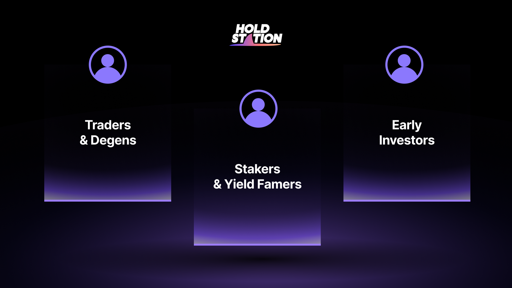

Holdstation is built for a new generation of crypto users—those who don’t just want tools, but want to belong. Our community strategy centers on three distinct, high-impact user groups:

## 🔹 Traders & Degens

Fast-paced, data-driven, and always chasing the next move. This group thrives on real-time insights, high-risk opportunities, and market reactivity. They define culture, spot trends early, and demand precision.

## 🔸 Stakers & Onchain Earners

Long-term aligned users who seek sustainable yield, aligned incentives, and participation in protocol growth. They value consistency, transparency, and upside tied to network success.

## 🔺 AI-Native Users

A rising class of users who integrate AI into their daily crypto workflows—whether it’s trading, discovery, or research. These are the experimenters, co-pilots, and automation-first thinkers shaping the future of DeFi x AI.

## 🟩 **Early Investors & Believers**

The foundational layer of our community—those who saw the vision early and backed it with conviction. More than capital, they bring patience, advocacy, and alignment with long-term protocol success. They are not just early—they are essential.

By aligning with the values, behaviors, and aspirations of these key groups, Holdstation isn’t just building for users—it’s building **with communities that move the market forward**.

