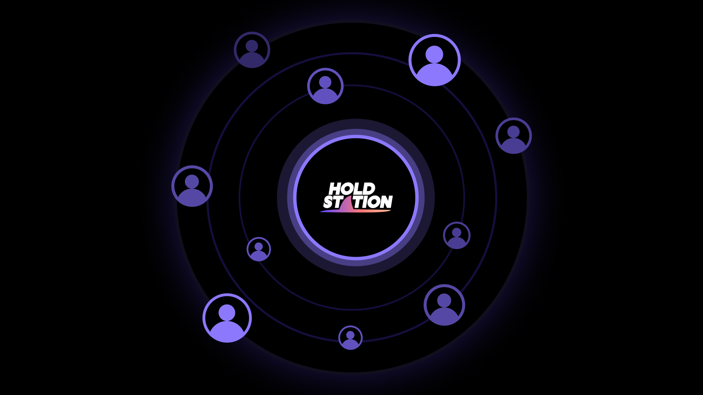

Holdstation’s journey started with Product-Market Fit (PMF), focusing on user needs, utility, and traction in DeFi and trading since its inception. By 2025, PMF evolves into Product Fit Community (PFC), aligning with AI-enhanced products, community incentives, and real-user verification (e.g., World ID).

## What is Product Fit Community?

PFC transforms products into cultural hubs where users belong, participate, and co-create. With digital identity, AI agents, and tokenized social capital, users seek:

* Identity reflection
* Daily relevance and utility
* Evolution via feedback
* Tangible and intangible rewards

## Holdstation’s PFC Philosophy

We build an ecosystem where:

* AI empowers users, enhancing—not replacing—their experience
* Communities unite around purpose, beyond protocol incentives
* Loyalty grows through utility, boosted by culture and status
* Verified humans thrive, excluding bots and extractive actors

From gamified wallets and trading leagues to autonomous agent co-ops and prediction games, Holdstation fosters natural, social, and rewarding daily interactions—beyond just financial gains. Whether trading DeFutures on Berachain, training AI agents on Solana, or engaging on World Chain, you’re not just a user—you’re part of Holdstation.
