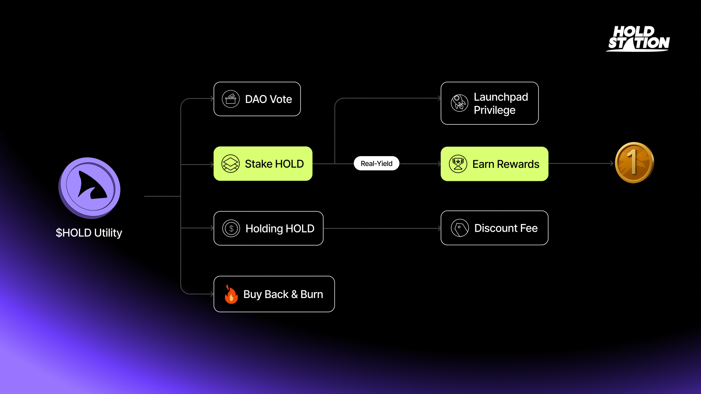

**$HOLD** - A governance token that enables holders to participate in the decision-making process through voting on DAO proposals, whitelist for launchpad and multiple fees discount.

HOLD token distribution follows a **fixed supply**, decaying emission model as a general principle. This means that as time passes, the token emission decreases according to a fixed schedule. This distribution model is designed to reward users who stake or hold tokens for longer periods.

## $HOLD Utility 

Our platform was accumulating an impressive **$3,300,000+ in trading fees** - an achievement that has us buzzing with excitement! Imagine the excitement as our official token $HOLD takes center stage, **sharing 40% of trading fees**. It's not just a makeover; it's a complete game-changer, igniting a fresh approach to maximizing gains of #realyield.

| **HOLD** **Utilities**  | **Descriptions**                                                                                               |
| ----------------------- | -------------------------------------------------------------------------------------------------------------- |
| Discounted Trading Fees | Users can enjoy a remarkable [**fee discount**](../../holdstation-defutures/defuture-fees/) when holding $HOLD |
| Delegate Voting         | Use HOLD to delegate voting rights                                                                             |
| Launcher Exclusive      | **HOLD Stakers** earn whitelist to paticipate every projects launch on Holdstation Launchpad                   |
