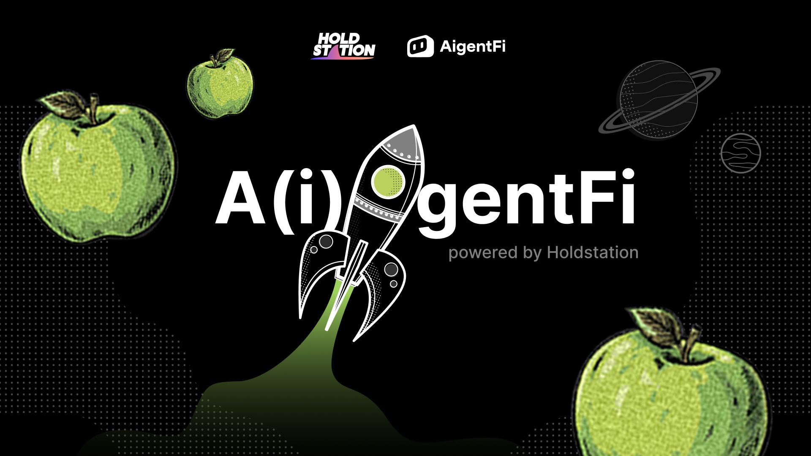

# 🤖 A(i)gentFi

## **What is A(i)gentFi?**

A(i)gentFi transcends the boundaries of traditional launchpads, it is a transformative force for creating, owning, and scaling autonomous AI agents. Designed to empower users with the ability to deploy AI entities effortlessly, A(i)gentFi delivers innovation with unique accessibility. No coding is required to launch AI agents tailored for trading, market analysis, content creation, and more.

This platform is where decentralized intelligence meets fair and transparent launches. Leveraging zkSync's scalable technology, A(i)gentFi turns groundbreaking ideas into scalable, revenue-generating AI ecosystems.

## **Revolutionizing AI with Multi-A(i)gent and Co-Ownership Technology**

At the heart of A(i)gentFi is its **multi-A(i)gent** framework, where multiple autonomous AI agents can collaborate, scale, and optimize complex tasks. Each A(i)gent operates as an independent powerhouse with its own unique abilities, but together they form an unstoppable synergy.

But the innovation doesn’t stop there. A(i)gentFi introduces **co-ownership**, a revolutionary approach where ownership and governance of these AI agents are tokenized. Stakeholders collectively decide the agent’s tasks, upgrades, and profit-sharing mechanisms, turning each A(i)gent into a decentralized, community-driven ecosystem. It’s not just ownership—it’s empowerment.

## **No Code Needed—Literally Zero**

The beauty of A(i)gentFi lies in its accessibility. Building, deploying, and managing an A(i)gent does not require technical skills. The **no-code interface** ensures that even non-developers can launch projects with ease. From intuitive prompts to pre-built frameworks, anyone can create, customize, and scale their agents without touching a single line of code.

Whether you’re launching a trading A(i)gent, a meme-generating machine, or a yield farming protocol, A(i)gentFi makes the process effortless while maintaining a high standard of innovation.

## **Key Features** 

* **Seamless Deployment:** Create and launch autonomous AI agents with just a few clicks.
* **AI-Driven Ecosystem:** From trading to storytelling, these agents are built to handle high-stakes tasks independently.
* **Decentralized Co-Ownership:** Tokenize your A(i)gent and share ownership, governance, and profits with your community.
* **Scalable Infrastructure:** Built on zkSync, ensuring speed, security, and scalability for all projects.
* **Fair Launch Protocol:** Transparent and fair, ensuring every project launched on A(i)gentFi is community-focused and accessible.

## **Why A(i)gentFi is the Future**

A(i)gentFi isn’t just a platform—it’s the cornerstone of decentralized intelligence. By fusing multi-AI agent technology with co-ownership and no-code accessibility, it democratizes the AI economy. Whether you’re an investor, creator, or community leader, A(i)gentFi offers the tools to build, scale, and profit from a new era of autonomous innovation.

***

More details for A(i)gentFi 

* [X](https://x.com/AigentFi)
* [Telegram Channel ](https://t.me/Official_AIAGENT)
* [Telegram Group ](https://t.me/Chat_AIAGENT)
* [Discord](https://discord.gg/BKSfhY7d)
* Website
* [Docs ](https://docs.aigentfi.com/)
