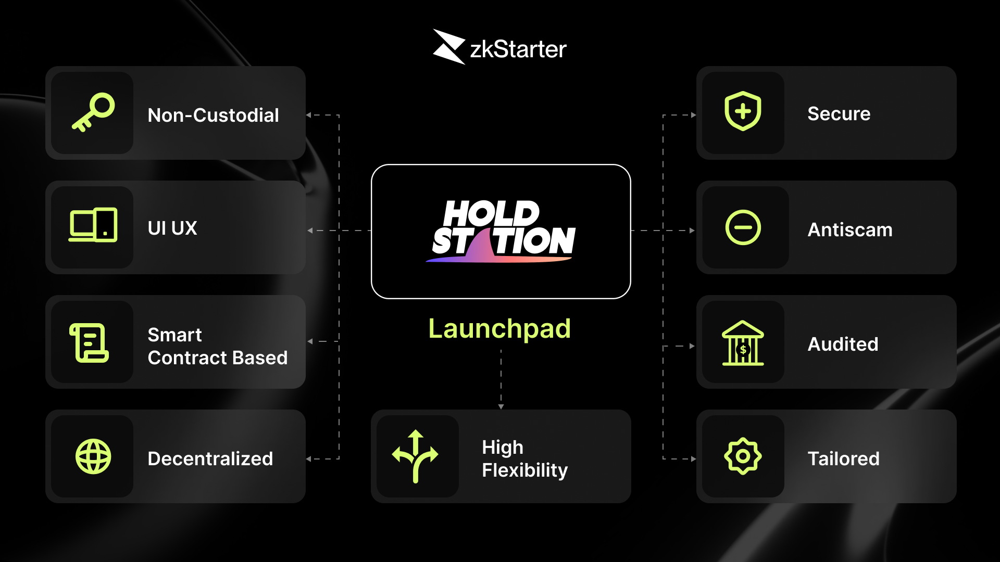

# 💡 zkStarter

**zkStarter stands as a foundational component within the zkSync ecosystem**, providing essential support for the token sales of promising projects. Our platform serves as a comprehensive hub for projects, investors, and our dedicated community, driving the success of zkSync.

zkStarter ensures a fair participation mechanism in token sales, free from complicated prerequisites. All users have an equal opportunity to engage in token purchases, regardless of investment size.

Thanks to the integration of advanced zkSync technologies like **Paymaster** and **native Account Abstraction**, participants in token sales on zkStarter can pay gas fees with any token or even have these fees fully sponsored.  Additionally, with one-click feature, users enjoy a seamless experience akin to Web 2 dApps.

.png)

## **zkStarter Launchpad Models**

zkStarter is a highly customizable launchpad, tailored to fit the specific needs of projects. Different token sale models can be customized on our platform:

### **Whitelist Sale** 

zkStarter can facilitate pre-sale events for whitelisted addresses, ensuring that the priority rights of project contributors are protected. 

### **First Come, First Serve**

This widely used token sale model offers a fixed number of tokens available to anyone until the supply is exhausted.

### Fair Subscription Model 

Holdstation aims for fairness, providing equal opportunities for all users to participate in token purchases without worrying about factors such as bots or competing with large buy orders.

To ensure fairness, our fair launch model adheres to principles that include Softcap and Hardcap.

* **Softcap** represents the minimum fundraising amount that the project aims to achieve. If the fundraising does not reach the soft cap level, all users will receive a refund of the amount they used to participate.
* **Hardcap** is the maximum fundraising amount that the project aspires to achieve. Once the hard cap is reached, tokens will be allocated to users at the end of the token sale.

> If the amount raised exceeds the hard cap, participants will receive tokens based on their contribution percentage in the pool. Any excess funds will be claimed at the end of the token sale.

### The unique features of zkStarter 

* **Non-Custodial:** Users have complete control over their assets throughout the entire token sale participation process.
* **UI/UX:** User-friendly interface and experience make the platform extremely easy to use, especially for newcomers.
* **Smart Contract Based:** All participation activities are automated by smart contracts, eliminating any intermediaries.
* **Decentralized:** Projects launching token sales set their fundraising parameters, and the community can participate freely without restrictions.
* **Secure:** Users can participate using all supported wallets, including Wallet Connect.
* **Anti-Scam:** Projects participating in the Launchpad undergo thorough checks by Holdstation for honesty and audit requirements.
* **Audited:** zkStarter has been audited by Verichain, Certik, PeckShield. 
* **High Flexibility:** zkStarter can tailor the token sale process to a project's specific needs, allowing the sale to unfold in multiple phases using various models.

